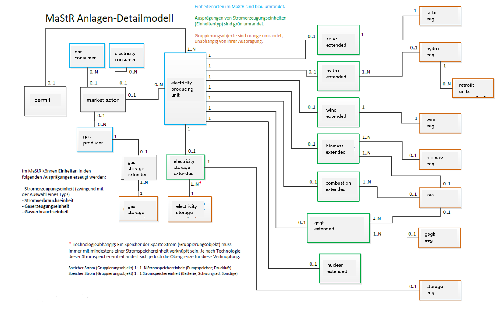

## Background

The Marktstammdatenregister (MaStR) has been operated by the German Federal Network Agency (Bundesnetzagentur, abbreviated as BNetzA) since January 31, 2019, as a central online database for data related to the German energy system. Owners of electricity or gas generating plants are obligated to report master data about themselves and their plants. Additionally, industrial facilities consuming large amounts of electricity must register if they are connected to at least a high-voltage electricity grid.

Most unit information is openly accessible and is published under an open data license, the Data licence Germany – attribution – version 2.0 (DL-DE-BY-2.0). This data can be downloaded, used, and republished with no restrictions, provided that proper attribution to the Bundesnetzagentur is given.

For units with a net capacity of less than 30 kW, some location information is restricted from publication. This includes street names, house numbers, parcel designations, and exact coordinates of units. The most detailed location information accessible for all units is the postal code or the municipality.

In our paper titled [Analyzing Data Reliability in Germany's Energy System: A Validation of Unit Locations of the Marktstammdatenregister](https://arxiv.org/abs/2304.10581), we provide further insights into the content and quality of the dataset.

## Content

The German Federal Network Agency regularly updates the dataset and adds new tables and attributes. Hence, the primary resource of information about the dataset should be the original website:

* Get information about the `bulk` data [here](https://www.marktstammdatenregister.de/MaStR/Datendownload) (in german)
* Get information about the `API` data [here](https://www.marktstammdatenregister.de/MaStRHilfe/subpages/webdienst.html) (in german)

## Difference between `bulk` and `API` dataset

As you may have noticed, we distinguish between `bulk` and `API` datasets. The `bulk` dataset refers to the data obtained from the zipped XML files downloaded from [here](https://www.marktstammdatenregister.de/MaStR/Datendownload) using the [`Mastr.download`][open_mastr.Mastr.download] function. The `API` data is obtained by requesting information via the SOAP-API and the [`soap_api.download.MaStRDownload`][open_mastr.soap_api.download.MaStRDownload] module.

??? question "Why is the table structure in the open-mastr database as it is?"

    The structure of the database is historically determined by the data retrieved via API. (open-mastr existed before the XML-dump was provided).
      See [MaStR data model](#Mastr-data-model)

## Tables in the database

!!! question "Confused by all the tables?"
    :sparkles: We regularly run the whole download and cleansing pipeline and upload the dataset as csv files at [zenodo](https://doi.org/10.5281/zenodo.6807425)! 

After downloading the MaStR, you will find a database with a large number of tables. Here we give a brief overview of what you can find in those tables:

### Tables in the local database

=== "_extended tables"
    The main information about the different technologies lies in the `_extended` tables. You can find the capacity, location, and other technology-specific attributes here.

    | Table name | Comments |
    |------|------| 
    | biomass_extended  |  |
    | combustion_extended  | *Conventional powerplants: Gas, Oil, Coal, ...* |  
    | gsgk_extended  | *gsgk is short for: Geothermal, Mine gas, and Pressure relaxation* |
    | hydro_extended  |  |
    | nuclear_extended  |  | 
    | solar_extended  |  |
    | storage_extended  |  | 
    | wind_extended  |  |

=== "_eeg tables"
    In germany, renewable energies were subsidized by the state - according to a law called 'EEG'. Relevant information like the 'EEG ID' are in the `_eeg` tables.

    | Table name | Comments |
    |------|------| 
    | biomass_eeg | |
    | gsgk_eeg  | *gsgk is short for: Geothermal, Mine gas, and Pressure relaxation* |
    | hydro_eeg  |  |
    | solar_eeg  |  |
    | storage_eeg  |  | 
    | wind_eeg  |  |

=== "Other tables"
    Other tables contain information about the grid, the energy market, or gas consumers and producers:

    | Table name | Comments |
    |------|------| 
    | balancing_area | *Related to the energy market* |
    | changed_dso_assignment  | *Units where the DSO responsibility changed* |
    | electricity_consumer  |  *Only large consumers* |
    | gas_consumer  |  *Only large consumers* |
    | gas_producer  |  |
    | gas_storage  |  |
    | gas_storage_extended  |  |
    | grid_connections  | *Does not contain geoinformation* |
    | grids  | *Does not contain geoinformation* |
    | locations_extended  | *Connects units with grids - to get coordinates of units use the _extended tables*|
    | market_actors  |  |
    | market_roles  |  |
    | permit  |  |
    | storage_units  |  |
    | kwk  | *short for: Combined heat and power (CHP)* |

### MaStR data model
A useful overview of the MaStR data model can be found [here (in german)](https://www.marktstammdatenregister.de/MaStRHilfe/files/webdienst/Objektmodell%20-%20Fachliche%20Ansicht%20V1.2.0.pdf). A translated version using the names from the tables you can find in your local database is presented here: 

=== "translated image (english)"
    

=== "original image (german)"
    

## Tables as CSV

Tables from the database can be exported to csv files. By default, all available power plant unit data will be exported
to csv files. 

For exported csv's additional available data is joined on basic unit data. For example: For biomass power plants one csv
is exported consisting of the join of four database tables (unit data, chp data, permit data, eeg data). We regularly run the whole download and cleansing pipeline and upload the dataset as csv files at [zenodo](https://doi.org/10.5281/zenodo.6807425). 
