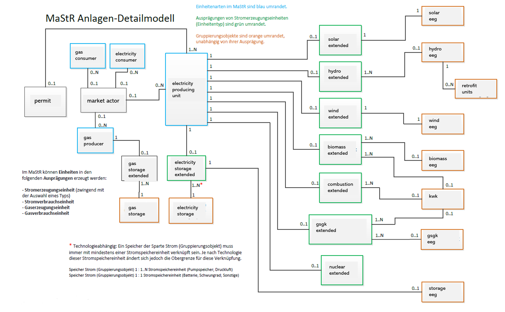
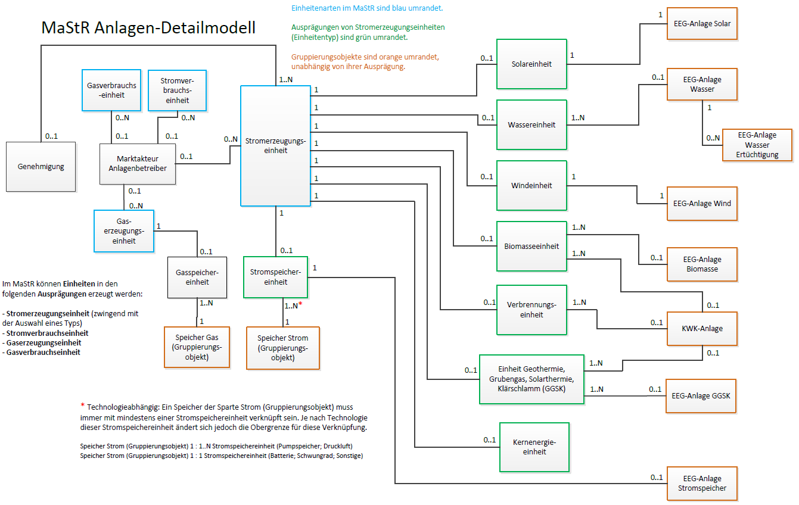

## Background

The Marktstammdatenregister (MaStR) has been operated by the German Federal Network Agency (Bundesnetzagentur, abbreviated as BNetzA) since January 31, 2019, as a central online database for data related to the German energy system. Owners of electricity or gas generating plants are obligated to report master data about themselves and their plants. Additionally, industrial facilities consuming large amounts of electricity must register if they are connected to at least a high-voltage electricity grid.

Most unit information is openly accessible and is published under an open data license, the Data licence Germany – attribution – version 2.0 (DL-DE-BY-2.0). This data can be downloaded, used, and republished with no restrictions, provided that proper attribution to the Bundesnetzagentur is given.

For units with a net capacity of less than 30 kW, some location information is restricted from publication. This includes street names, house numbers, parcel designations, and exact coordinates of units. The most detailed location information accessible for all units is the postal code or the municipality.

In our paper titled [Monitoring Germany's Core Energy System Dataset: A Data Quality Analysis of the Marktstammdatenregister](https://doi.org/10.1145/3717413.3717421), we provide further insights into the content and quality of the dataset.

## Content

The German Federal Network Agency regularly updates the dataset and adds new tables and attributes. Hence, the primary resource of information about the dataset should be the original website:

* Get information about the `bulk` data [here](https://www.marktstammdatenregister.de/MaStR/Datendownload) (in german)
* Get information about the `API` data [here](https://www.marktstammdatenregister.de/MaStRHilfe/subpages/webdienst.html) (in german)

## Difference between `bulk` and `API` dataset

As you may have noticed, we distinguish between `bulk` and `API` datasets. The `bulk` dataset refers to the data obtained from the zipped XML files downloaded from [here](https://www.marktstammdatenregister.de/MaStR/Datendownload) using the [`Mastr.download`][open_mastr.Mastr.download] function. The `API` data is obtained by requesting information via the SOAP-API and the [`soap_api.download.MaStRAPI`][open_mastr.soap_api.download.MaStRAPI] module.

## Tables in the database

!!! question "Confused by all the tables?"
    :sparkles: We regularly run the whole download and cleansing pipeline and upload the dataset as csv files at [zenodo](https://doi.org/10.5281/zenodo.6807425)! 

After downloading the MaStR, you will find a database with a large number of tables. Here we give a brief overview of what you can find in those tables:

### Tables in the local database

=== "Units related to electric power"
    The main information about power plants producing power/gas and other units is in tables prefixed with
    "Einheiten"/"units". You can find the capacity, location, and other technology-specific attributes here.

    | Original German name | English name | Comments |
    |------|------|------|
    | EinheitenBiomasse | units_biomass | Biomass combustion power plants |
    | EinheitenGeothermieGrubengasDruckentspannung | units_gsgk | Geothermal, mine gas and pressure relaxation units |
    | EinheitenKernkraft | units_nuclear | Nuclear power plants |
    | EinheitenSolar | units_solar | Solar power plants |
    | EinheitenStromSpeicher | units_electricity_storage | Electric power storage units |
    | EinheitenStromVerbraucher | units_electricity_consumers | *Large* electric power consumers |
    | EinheitenVerbrennung | units_combustion | Conventional combustion power plants: gas, oil, coal, … |
    | EinheitenWasser | units_hydro | Hydroelectric power plants |
    | EinheitenWind | units_wind | Wind power plants |

=== "Units related to gas"
    The tables prefixed with "EinheitenGas"/"units_gas" refer to units related to gas.

    | Original German name | English name | Comments |
    |------|------|------|
    | EinheitenGasErzeuger | units_gas_producers | Gas production units (natural gas extraction, biomethane production, …)|
    | EinheitenGasSpeicher | units_gas_storage | Gas storage units |
    | EinheitenGasverbraucher | units_gas_consumers | *Large* gas consumers |

=== "Groups of units"
    Tables prefixed with "Anlagen"/"installations" define groups of units; they have a column called
    "VerknuepfteEinheitenMastrNummern"/"linkedUnitsMastrNumbers", which you can use to look up the connected units.

    Some of them are special subsidy groups: In Germany, renewable energies as well as combined heat and power (CHP/KWK)
    plants are subsidized by the state according to laws called 'EEG' (for renewable energies) and 'KWK' (for CHP
    plants). These tables contain information about the subsidies such as the 'EEG ID'.

    | Original German name | English name | Comments |
    |------|------|------|
    | AnlagenEegBiomasse | installations_eeg_biomass |  |
    | AnlagenEegGeothermieGrubengasDruckentspannung | installations_eeg_gsgk |  |
    | AnlagenEegSolar | installations_eeg_solar |  |
    | AnlagenEegSpeicher | installations_eeg_storage |  |
    | AnlagenEegWasser | installations_eeg_hydro |  |
    | AnlagenEegWind | installations_eeg_wind |  |
    | AnlagenGasSpeicher | installations_gas_storage |  |
    | AnlagenKwk | installations_kwk |  |
    | AnlagenStromSpeicher | installations_electricity_storage |  |

=== "Other tables"
    Other tables contain information about the grid, the energy market and changes to units and market actors.

    | Original German name | English name | Comments |
    |------|------|------|
    | Bilanzierungsgebiete | balancing_areas | Balancing areas |
    | EinheitenAenderungNetzbetreiberzuordnungen | changes_dso_assignment | Changes of DSO assigment of units |
    | EinheitenGenehmigung | permits | Unit permits |
    | Einheitentypen | unit_types | Meta information about unit types. **Not imported by open-mastr** |
    | Ertuechtigungen | retrofits | Retrofits of units |
    | GeloeschteUndDeaktivierteEinheiten | deleted_and_deactivated_units | Deleted & deactived units |
    | GeloeschteUndDeaktivierteMarktakteure | deleted_and_deactivated_market_actors | Deleted & deactived market actors |
    | Katalogkategorien | catalog_categories | Meta information about MaStR values. **Not imported by open-mastr** |
    | Katalogwerte | catalog_values | Meta information about MaStR values. **Not imported by open-mastr** |
    | Lokationen | locations | Connects units with grid connections |
    | Lokationstypen | location_types | Meta information location types. **Not imported by open-mastr** |
    | Marktakteure | market_actors | Market actors |
    | MarktakteureUndRollen | market_actors_and_roles | Roles filled by market actors |
    | Marktfunktionen | market_functions | Meta information about market functions. **Not imported by open-mastr** |
    | Marktrollen | market_roles | Meta information about market roles. **Not imported by open-mastr** |
    | Netzanschlusspunkte | grid_connections | Connects locations with grids |
    | Netze | grids | Grids |

### MaStR data model

A useful overview of the MaStR data model can be found at the MaStR [help page](https://www.marktstammdatenregister.de/MaStRHilfe/subpages/faq.html). A translated version using the names from the tables you can find in your local database is presented here:

=== "translated image (english)"
    

=== "original image (german)"
    

## Tables as CSV

Tables from the database can be exported to CSV files. By default, all available power plant unit data will be exported
to csv files.

!!! warning "Joining of tables for CSV export has been removed"
    In versions > `v1.0.0`, the database tables are exported to CSV as they are. Joins between unit, CHP/EEG data and permits are not done anymore.

We occasionally run the whole download and cleansing pipeline and upload the dataset as csv files at [zenodo](https://doi.org/10.5281/zenodo.6807425).
