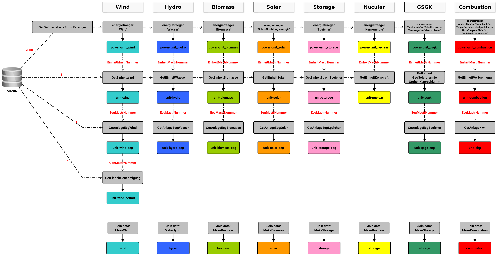

********************
Downloading raw data
********************

The intention of open-MaStR is to provide tools to receiving a complete as possible and accurate as possible list of
power plant units based on `MaStR <https://www.marktstammdatenregister.de>`_.
Therefore, in particular, methods for bulk download of the entire MaStR database are provided.

Configuration
=============

Prior to starting the download of data from MaStR-API, you can set some configuration parameters.

.. csv-table:: Configuration parameters MaStR downloader
   :header: "Parameter", "Description", "Location"
   :widths: 10, 50, 10

   "API_MAX_DEMANDS (int)", "Limit total downloaded units (defaults to 2,000)", "`soap_api/sessions.py <https://github.com/OpenEnergyPlatform/open-MaStR/blob/ae87a9ed49b6b379714fe8d5f266e5634ea6f3fb/soap_api/sessions.py#L38>`_"
   "DATA_VERSION (i.e. v2.7.0)", "Distinguishes different downloads", "`soap_api/utils.py <https://github.com/OpenEnergyPlatform/open-MaStR/blob/d2718ec2635360ec5f7d3eb26b4b43cf66bfdba3/soap_api/utils.py#L14>`_"
   "TOTAL_POWER_UNITS (int)", "Total number of power generation unit (need to be queried from `web interface <https://www.marktstammdatenregister.de/MaStR/Einheit/Einheiten/ErweiterteOeffentlicheEinheitenuebersicht>`_)", "`soap_api/utils.py <https://github.com/OpenEnergyPlatform/open-MaStR/blob/d2718ec2635360ec5f7d3eb26b4b43cf66bfdba3/soap_api/utils.py#L16>`_"

All of them are optional. For a bulk download, *API_MAX_DEMANDS* does not need to be changed. For testing purposes it
makes sense to decrease *API_MAX_DEMANDS*.
*DATA_VERSION* can be changed abritrarily, but consider what you push to the repo.
The parameter *TOTAL_POWER_UNITS* has two functions: (1) it can be set to total number of power generating units (see
link in above table) to query all power plants available. In a second case (2) it can be used to limit total units
to be download when calling `soap_api/main.py`.
You might need to comment in/ comment out some download functions.

Download
========

In the file `main.py`, function for the download of unit data distinguished by type of technology are collected.
Call

.. code-block:: bash

   python soap_api/main.py

to start the download process.

Details of the download process
===============================

The download of power plant data from https://www.marktstammdatenregister.de is split in three to five steps (gray
boxes), different for each technology.
For each step the resulting data is saved to CSV files using the names from colored boxes.

These steps are also reflected by the following functions from `main.py`.

.. csv-table:: Download functions on the example of wind power
   :header: "Function", "Description", "Results files"
   :widths: 10, 40, 10

   "`setup_power_unit_wind()`", "Read wind unit from existing file. In case it is only available in general power unit file, write it to wind power units file (same data as in `download_power_unit()`).", "bnetza_mastr_<version>_power-unit_wind.csv"
   "`download_power_unit()`", "Download basic information about wind power plants from **GetGefilterteListeStromErzeuger**. Data includes the *MaStR-Nummer*, which is used as identifier for other tables.", "bnetza_mastr_<version>_power-unit_wind.csv"
   "`download_unit_wind()`", "Retrieve extended information about wind power plant from **GetEinheitWind**.", "bnetza_mastr_<version>_unit-wind.csv"
   "`download_unit_wind_eeg()`", "Information collected in context of legal act EEG (**GetAnlageEegWind)**)", "bnetza_mastr_<version>_unit-wind-eeg.csv"
   "`download_unit_wind_permit()`", "Information about permit of wind power plant (**GetEinheitGenehmigung**)", "bnetza_mastr_<version>_unit-wind-permit.csv"
   "`make_wind()`", "Join all wind power plant data to one table.", "bnetza_mastr_<version>_wind.csv"

All resulting data is stored into `$PWD/data/`.
New downloads will add data to existing `.csv` files