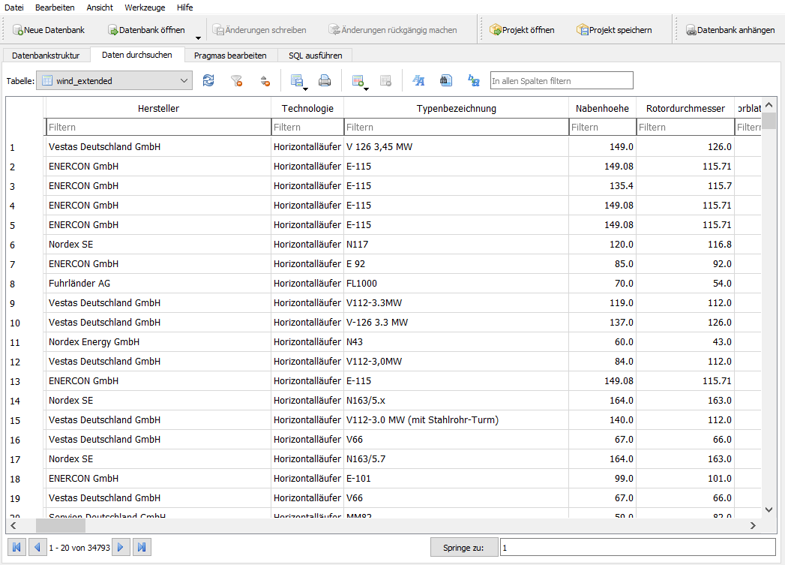

# Getting Started

The intention of open-MaStR is to provide tools for receiving a complete as possible and accurate as possible list of
power plant units based on the public registry Marktstammdatenregister (short: [MaStR](https://www.marktstammdatenregister.de)).

## Downloading the MaStR data


The MaStR dataset is updated on a daily basis. To download todays MaStR and save it in a sqlite database, you will use the [`Mastr`][open_mastr.Mastr] class and its [`download`][open_mastr.Mastr.download] method. The [`download`][open_mastr.Mastr.download] method offers two different ways to get the data by changing the `method` parameter (if not specified, `method` defaults to "bulk"):

1. `method` = "bulk": Get data via the bulk download from [MaStR/Datendownload](https://www.marktstammdatenregister.de/MaStR/Datendownload). Use this if you want to download the whole dataset (few Gigabite) or if you want to download all units of a given technology (e.g. all wind turbines in Germany).
2. `method` = "API": Get data via the MaStR SOAP-API. Use this if you want specific information about single units and if you have registerd to get an API token.


### Bulk download

The following code block shows the basic download commands:

```python
from open_mastr import Mastr

db = Mastr()
db.download()
```

When a `Mastr` object is initialized, a sqlite database is created in `$HOME/.open-MaStR/data/sqlite`. With the function `Mastr.download()`, the **whole MaStR is downloaded** in the zipped xml file format. It is then read into the sqlite database and simple data cleansing functions are started.

More detailed information can be found in the section [bulk download](advanced.md#bulk-download).

API download
-----------------------------------
When using `download(method="API")`, the data is retrieved from the MaStR API. For using the MaStR API, credentials 
are needed (see [SOAP API download](advanced.md#soap-api-download)).

```python
from open_mastr import Mastr

db = Mastr()
db.download(method='API')
```

The default settings will save retrieved data into the sqlite database. The function can be used to mirror the open-MaStR database using the SOAP API. Note that the data provided by the bulk download and the SOAP API is similar, but not exactly the same.

## Accessing the database

For accessing and working with the MaStR database after you have downloaded it, you can use sqlite browsers 
such as [DB Browser for SQLite](https://sqlitebrowser.org/) or any python module
which can process sqlite data. Pandas, for example, comes with the function
[read_sql](https://pandas.pydata.org/docs/reference/api/pandas.read_sql.html).


=== "pandas"
    ```python
    import pandas as pd

    table="wind_extended"
    df = pd.read_sql(sql=table, con=db.engine)
    ```

=== "DB Browser for sqlite"
    { loading=lazy }

## Exporting data

The tables in the database can be exported as csv files. While technology-related data is joined for each unit,
additional tables are mirrored from database to csv as they are. To export the data you can use to method `to_csv`.

```python

    tables=["wind", "grid"]
    db.to_csv(tables)
```